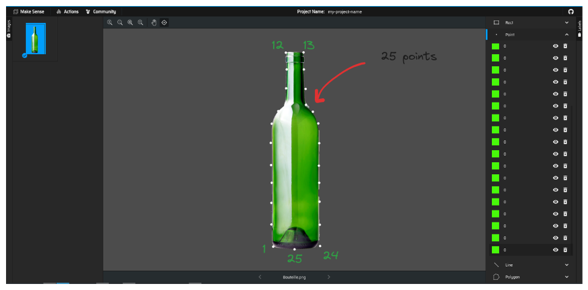

# Warp_Transformation
The warp transformation, like the one Photoshop has.

## Installation
* Install python==3.10
* Install requirements.txt `pip install -r requirements.txt`

## Usage Guide

This module transfers a sticker to a specific position which is declared by landmarks.
The first step is to draw meaningful landmarks on your stickers. The landmarks should cover you sticker.
The next step is to draw your target (destination) landmarks on the target image. 

I used `makesense.ai` website to draw landmarks.

After that follow the `inference.py` for more.

## Result

